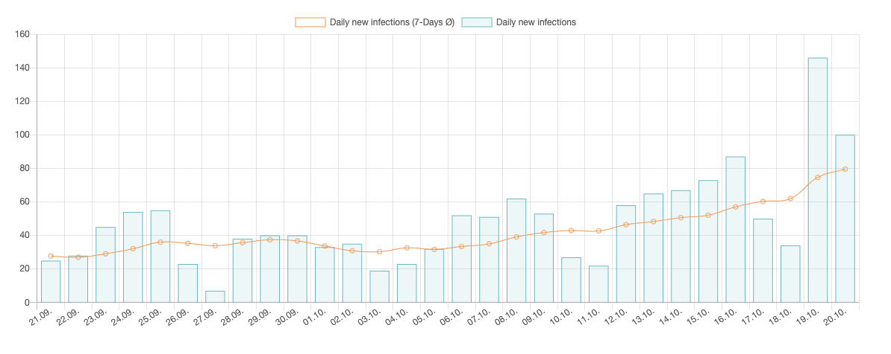
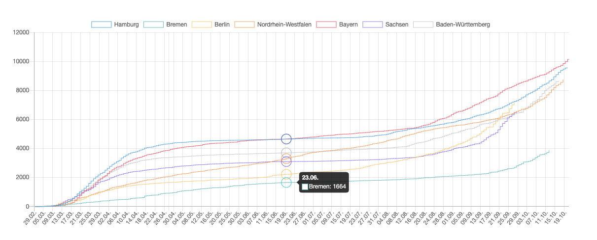
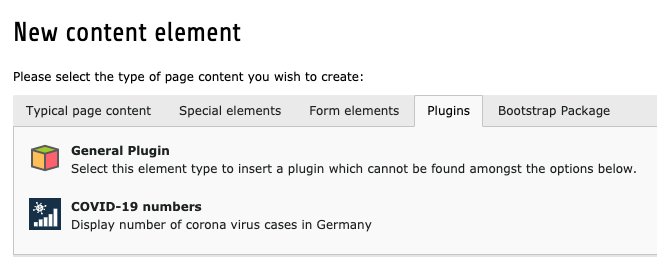
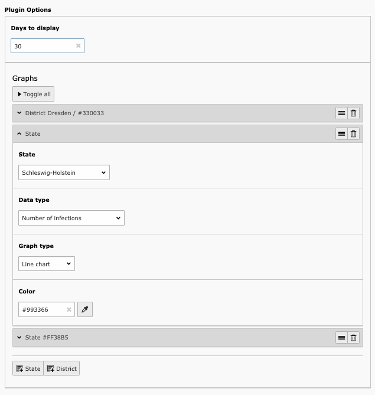

Overview
====================

This TYPO3 extensions displays data about COVID-19 (Coronavirus SARS-CoV-2) from the German RKI.

Examples
--------

Features
--------

Create your own graph with the data you like:

* Compare cities or states in one graph
* Display different corona virus numbers
    * Number of infections
    * Daily new infections
    * Daily new infections (7-Days Ø)
    * Incidence value: Number of infections (7-Days Σ/100.000)
* Display as line or bar graph
* Select color
* Refresh data with scheduler

Installation
============

.. rst-class:: bignums

1. Install via composer

   .. code:: bash

      composer require blueways/bw-covid-numbers

2. Include TypoScript

   Enable the extension in the Extension Manager and include the **static TypoScript template** or manually include setup and constants.

3. Add scheduler task

   Create a new task and select **COVID-19 numbers cache**. Let it run once a day.

Usage
=====

Add the new plugin "COVID-19 numbers" to any page and set up your desired output data in plugin settings.

Configuration
=============

Setup
-------------

You can customize the style of the bar and line chart by setting the dataset properties of chart.js via TypoScript:

.. code:: typoscript

	plugin.tx_bwcovidnumbers_pi1.settings {
		datasetOptions {
			line {
				pointRadius = 0
				pointHoverRadius = 10
				steppedLine = true
				# For more options see: https://www.chartjs.org/docs/latest/charts/line.html#dataset-properties
			}
			bar {
				borderWidth = 0
				hoverBackgroundColor = rgba(0,0,0,0.5)
				# For more options see: https://www.chartjs.org/docs/latest/charts/bar.html#dataset-properties
			}
		}
		chartOptions {
			aspectRatio = 2
			# For more options see:
			# https://www.chartjs.org/docs/latest/general/options.html
			# https://www.chartjs.org/docs/latest/general/responsive.html
		}
	}

.. tip::

   To change the onload of the charts, have look at the ``initChartJs.js``. This file gets included via ``plugin.tx_bwcovidnumbers_pi1.settings.initChartJs``.

Todos
=====

Possible improvements:

* Canvas output via fluid template

Contribute
==========

Feel free to contribute!

* `Bitbucket-Repository <https://bitbucket.org/blueways/bw_covid_numbers/>`__

