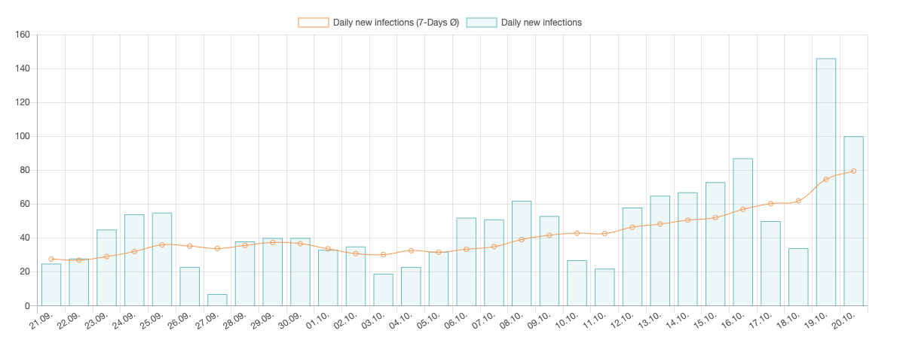
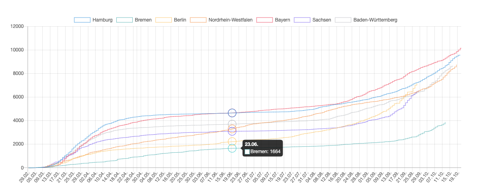
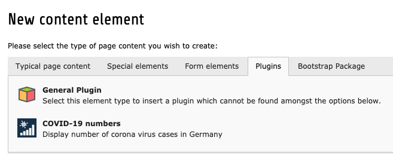
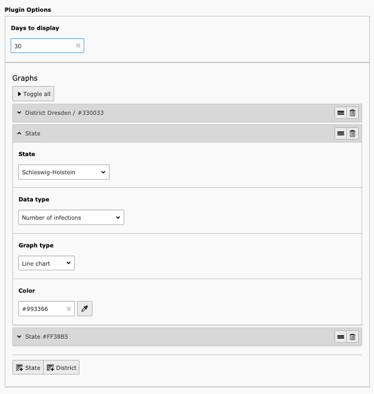

# COVID-19 TYPO3 extension

This TYPO3 extensions displays data about COVID-19 (Coronavirus SARS-CoV-2) from the German RKI.

## Example





## Installation

* Get the extension
    ```
    composer require blueways/bw-covid-numbers
    ```
* Include the TypoScript template

## Usage

Add the new plugin "COVID-19 numbers" to any page and set up your desired output data in plugin settings.





Add a new scheduler task to clear the cache and get daily new numbers.

## Style

You can customize the style of the bar and line chart by setting the dataset properties of chart.js via TypoScript:

```
plugin.tx_bwcovidnumbers_pi1.settings {
    datasetOptions {
        line {
            pointRadius = 0
            pointHoverRadius = 10
            steppedLine = true
            # For more options see: https://www.chartjs.org/docs/latest/charts/line.html#dataset-properties 
        }
        bar {
            borderWidth = 0
            hoverBackgroundColor = rgba(0,0,0,0.5)
            # For more options see: https://www.chartjs.org/docs/latest/charts/bar.html#dataset-properties
        }
    }
}
```

To change the onload of the charts, have look at the ```initChartJs.js```. This file gets included via ```plugin.tx_bwcovidnumbers_pi1.settings.initChartJs```.

## ToDos

* Any wishes?

## Contribute

Feel free to contribute! [Bitbucket-Repository](https://bitbucket.org/blueways/bw_covid_numbers)
